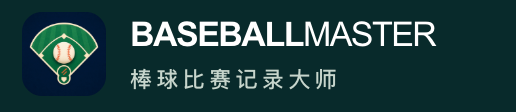

# BaseballMaster 已确认品牌基准

状态：**用户已确认，固定沿用。** 确认日期：2026-09-28。

用户确认原话：“这个 logo 和 字体设计很好，注意固定下来。”



## 固定的视觉组合

- 左侧使用现有深蓝底球场 App 图标，保留绿色球场、棒球和完整图形，不另行描摹、裁切或更换。
- 右侧第一行固定为全大写 `BASEBALLMASTER`，不插入空格；`BASEBALL` 使用粗体，`MASTER` 使用常规字重。
- 右侧第二行固定为“棒球比赛记录大师”，使用现有较宽字距，与英文左对齐。
- 主品牌组合使用深绿色背景、白色英文和浅灰绿色中文。导航按钮的强调色不改变品牌标识本身。
- 后续官网页面与宣传材料默认复用这套组合；常规功能修改不重新设计品牌。用户明确要求改变时，再更新本基准及参考图。

## 当前官网参数

这些值来自用户确认时的实际官网 CSS，单位为 CSS px；参考截图的设备像素尺寸不作为网页字号。

| 项目 | 固定基准 |
| --- | --- |
| 排列 | 左侧图标、右侧两行文字，垂直居中 |
| 图标 | 42 × 42 px，圆角 10 px |
| 图标与文字间距 | 12 px |
| 英文字体 | `Arial`，回退到官网系统字体栈 |
| 英文字号 / 字距 | 17 px / `-0.045em` |
| 英文粗细 | `BASEBALL: 800`；`MASTER: 400` |
| 英文颜色 | `#ffffff` |
| 中文字体 | `-apple-system, BlinkMacSystemFont, "PingFang SC", "Microsoft YaHei", sans-serif` |
| 中文字号 / 字重 | 11 px / 450 |
| 中文字距 / 顶部间距 | `0.2em` / 5 px |
| 中文颜色 | `#c6d5cc` |
| 品牌背景色 | `#092a2a` |

手机、页脚和隐私／支持页沿用当前已经实现的响应式尺寸，保留图文组合、名称、字重对比和颜色。不要通过插入文本空格来模拟中文字距，也不要把整个英文标识统一成同一种字重。

## 复用来源

- 原始 App 图标：[AppIcon-1024.png](../../BaseballMaster/Assets.xcassets/AppIcon.appiconset/AppIcon-1024.png)。
- 网页图标：[app-icon.png](../../website/public/assets/app-icon.png)，256 px 网页版本。
- 官网样式：[site.css](../../website/public/assets/site.css) 的 `.brand`、`.brand-light`、`.brand small` 及现有响应式规则。
- 参考图、素材哈希和机器可读参数：[brand-baseline.json](brand-baseline.json)。

网页标识沿用现有结构：

```html
<a class="brand" href="/" aria-label="BaseballMaster 首页">
  
  <span>BASEBALL<span class="brand-light">MASTER</span><small>棒球比赛记录大师</small></span>
</a>
```

首页、隐私页和支持页目前已经共享上述样式。本次确认只归档品牌基准和项目约定，线上视觉保持用户确认的版本。
