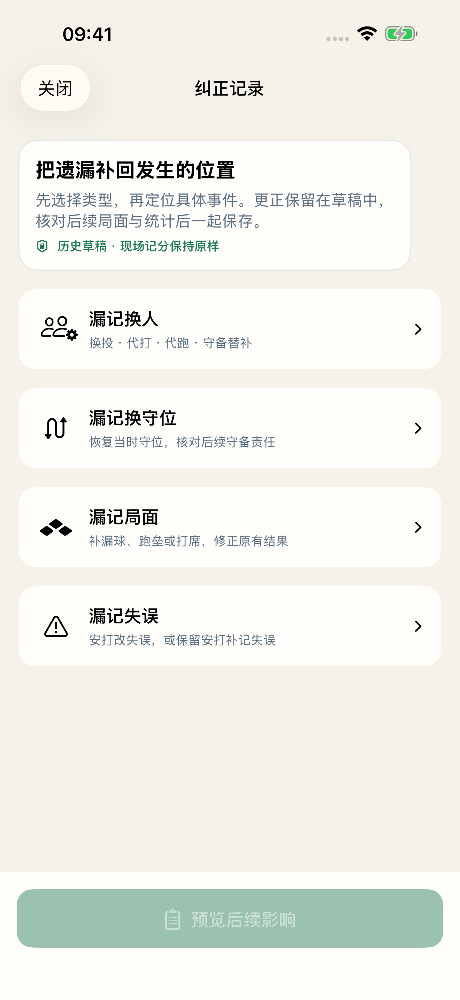
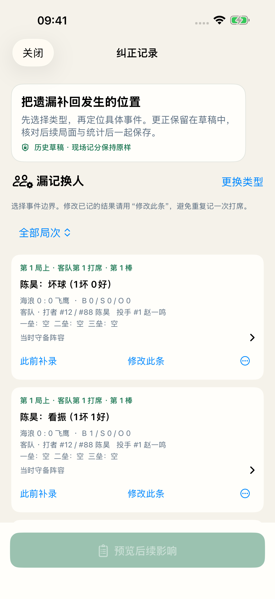
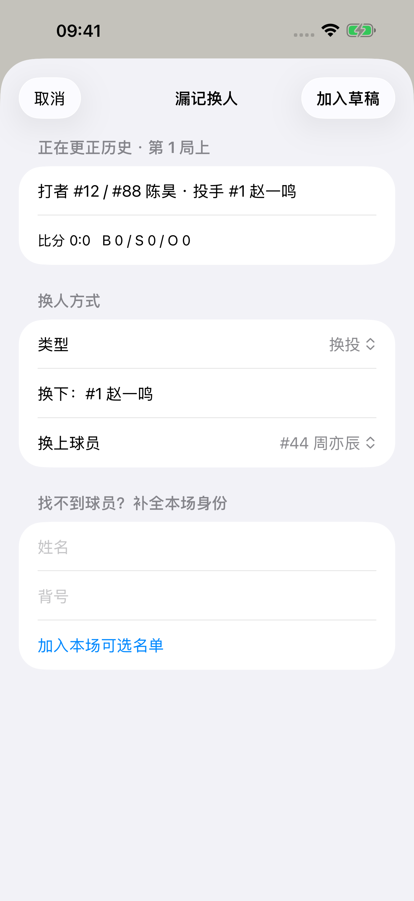
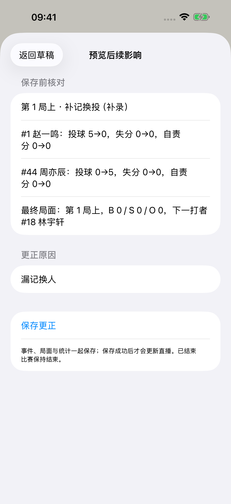
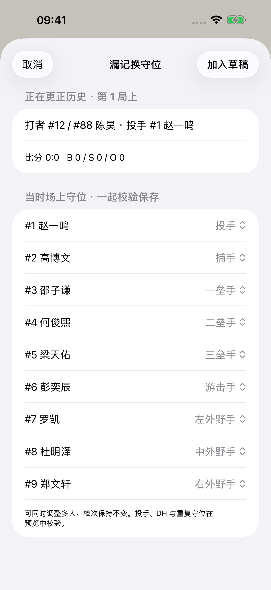
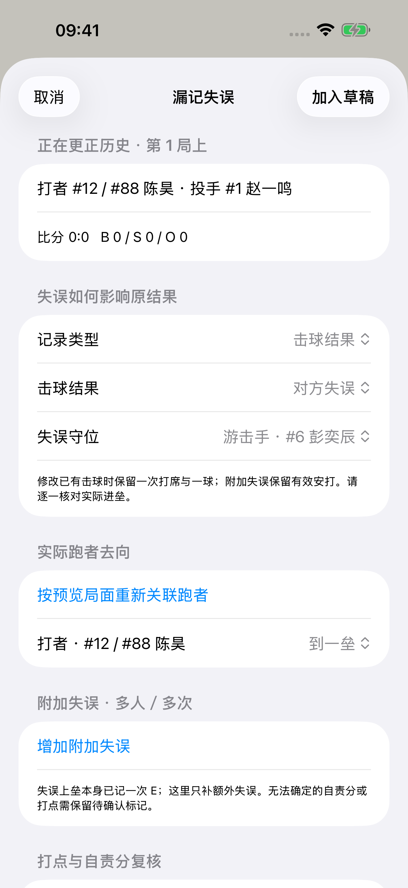

# 2.1 记分纠错：功能与验证

2026-09-29。开发版 2.1（1），本地交付；未上传 App Store。

## 使用方法

现场记分页右上角的历史箭头，或比赛结果页的“纠正记录”，都能打开相同入口。

1. 选择漏记换人、漏记换守位、漏记局面或漏记失误。
2. 按局次定位主／客队打席和具体事件，查看事件前的打者、投手、B/S/O、比分、垒况及守备阵容。
3. 用“此前补录”或菜单中的“此后补录”插入；已有事件漏了一部分结果时，用“修改此条”。
4. 在同一草稿中补换人、换守位、进垒和失误；可删除误录、调整顺序、明确重新关联局面和跑者。冲突会阻止保存。
5. 预览后续影响，核对比分和个人统计变化，填写原因后保存。关闭可放弃草稿；保存失败可继续重试。
6. 更正历史记录原因、时间及影响。撤回最近一次更正会生成新的草稿，保留此后记分并重新校验；普通撤销不会抹掉已保存的更正历史。

## 已实现的四类纠错

- **换人**：换投、代打、代跑、守备替补；可补全本场球员身份。按事件边界重算，保留既有投球、棒次和打席；支持再次上场和连续换人。
- **换守位**：多人同时调整，校验重复守位、投手及 DH 约束；重新归属后续接杀、助杀、失误，保持打序。
- **漏记局面**：补一球、击球结果、跑者进垒／得分／出局；修正已有结果。改变棒次或半局时须明确处理冲突。记不清过程时可单独修正已知局面或补充说明，不虚构安打、打点和责任。
- **漏记失误**：结果改判失误，或保留安打补附加失误；可指定多名责任人和次数、调整实际进垒，并复核本事件的 RBI、逐投手 ER 和后续非自责跑者。撤回与再次修改不会重复累加。

换投后的承接跑者、代跑后的原投手责任、野手选择替代承接跑者、打席中途换投的保送责任，以及两好球后代打三振归属，已加入共享记分逻辑和回归。

复杂失误链仍需记录员判断：不是所有失误都取消打点，也不是此后的所有得分都属于非自责分。没有确认责任的更正保留“待确认”；可在后续得分事件逐条复核。规则依据为 [Official Baseball Rules 9.15(b)、9.16(g/h)](https://img.mlbstatic.com/mlb-images/image/upload/mlb/ub08blsefk8wkkd2oemz.pdf)。

## 旧比赛支持边界

| 已保存资料 | 实际能力 |
| --- | --- |
| 本版本记录的完整操作日志与检查点 | 从可用事件边界重放四类更正，自动结果与原操作成组 |
| 旧版有结构化投球、击球、跑垒和时钟资料，且原比分与全部原始统计能完全重放一致 | 经无修改重放校验后允许历史更正 |
| 旧版只有文字、缺少换人／跑垒资料，或重放与原统计不一致 | 保留原始历史；从现有可靠局面做局部修正或补说明，明确提示不能重算更早过程 |

不会从姓名、中文日志或默认跑垒猜测缺失过程。旧比赛开始续记后，新增操作会带完整纠错资料。局面修正／责任待确认标记会出现在结果、球队统计、TXT、Box Score PDF、详细和简版逐打席 PDF、统计 PDF，以及直播快照中。

## 保存与联动

- 现场和纠错草稿复用 `GameStore` 记分方法；预览使用独立内存状态，不写正式比赛、不推送直播。
- 尽量保留原事件／打席 ID；新增 ID 稳定生成，裁判取消操作的撤销状态同步保留身份映射。
- 比赛修订号防止过时草稿覆盖新记分；事件、统计、修订记录原子保存，失败恢复原状。
- 已结束比赛保持结束、原结束时间和停止计时。关闭或过期直播不会重开，也不延长到期时间。生产直播开关仍关闭。
- 备份格式为 3，可读取旧格式 1／2；数据库最低读取版本标记为 4，避免旧 App 静默丢失新增历史。原有迁移／故障保护继续有效。

## 验证证据

本轮新增 16 项 `testHistory…` 测试，连同原有回归覆盖 A01–A11 的主要可自动验证场景：

| 场景 | 验证内容 |
| --- | --- |
| A01–A02 | 换投前后用球、承接跑者、野手选择责任、两好球代打、两坏球换投、代跑 A→B→A |
| A03、A08 | 历史二游交换、多人阵容调整、DH／大谷条款、双重换人、按当时阵容分配 E |
| A04–A05 | 漏球导致保送、后续棒次冲突修复、补第三出局不自动移局、裁判取消原结果 |
| A06–A07 | 局面不完整标记、安打改失误、多人多次附加失误、手工 RBI／ER 复核、反复撤回 |
| A09 | 草稿隔离、过时版本阻止、写入故障回滚与重试、磁盘重启、赛后备份恢复 |
| A10 | TXT／PDF／直播投影使用已保存数据与待确认标记；原有有效／过期直播测试 |
| A11 | 普通棒球、教练投手、TB、DH、阵容再次上场、原有撤销和数据升级测试 |

- 完整 App 单元与集成测试：161 项通过；使用本机临时直播服务完成网络集成测试。
- 关键 UI：大屏和小屏的纠错流程、守位／失误编辑器、原现场记分控制均通过。
- 服务端回归：13 项通过。
- 真机 Release 编译验证与 2.2 同步回归见本目录的 `validation.json`。
- 真机覆盖安装、签名归档和 App Store 上传仍按发布流程执行，不由模拟器截图代替。

本机原始证据在 `output/validation/2.1/corrections/history-complete-small.xcresult`、`output/validation/2.1/corrections/history-release-validation.xcresult` 和 `output/validation/2.1/corrections/correction-delivery-large.xcresult`，生成目录不纳入 Git。

## 实际截图

截图均来自 iOS 模拟器运行的 App 和合成比赛，通过 UI 自动化操作获取；没有绘制或修改界面图像。

[打开截图总览](screenshots/index.html)

